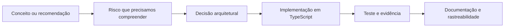

# 🔐 Secure MCP Enterprise with TypeScript

### Aprenda MCP do zero e evolua um servidor TypeScript com segurança enterprise

 

Um projeto educacional, construído passo a passo, para compreender o **Model Context Protocol (MCP)** e aplicar controles de segurança inspirados no guia publicado pela **NSA**.

[📚 Começar o tutorial](./tutorial/README.md) · [🧭 Ver o roteiro](#-roteiro-de-aprendizado) · [🛡️ Consultar a matriz de controles](./docs/security-controls-matrix.md)

---

## 💡 Por que este projeto existe?

Conectar aplicações de inteligência artificial a dados e ações externas é poderoso, mas também cria novas fronteiras de confiança. Uma integração pode funcionar tecnicamente e, ainda assim, permitir acesso indevido, aceitar entradas maliciosas ou executar ações com privilégios excessivos.

Este repositório acompanha a construção progressiva de um **MCP Server em TypeScript** chamado **Enterprise Risk Knowledge MCP Server**. Além de mostrar como o protocolo funciona, o tutorial explica por que cada decisão de segurança existe, onde ela deve ser aplicada e como podemos testá-la.

A proposta é aprender fazendo: primeiro entendemos o problema em linguagem simples; depois apresentamos o termo técnico; por fim, relacionamos o conceito ao código e às recomendações de segurança.

> [!IMPORTANT]
> Este é um projeto independente e educacional. Ele não representa certificação, homologação ou conformidade oficial da NSA. O relatório apresenta riscos e recomendações; as decisões arquiteturais e implementações deste repositório são interpretações técnicas documentadas durante o tutorial.

## 🧠 O que você aprenderá?

Ao acompanhar o projeto, você aprenderá a explicar a arquitetura do MCP, criar um MCP Server com TypeScript e reconhecer os pontos em que dados ou comandos atravessam fronteiras de confiança.

A implementação evoluirá gradualmente para abordar validação de entradas, identidade, autorização, privilégio mínimo, aprovação humana, proteção contra replay, filtragem de resultados, auditoria, resiliência, isolamento e segurança da cadeia de dependências.

O objetivo não é apenas chegar a um código funcional. Ao final, você deverá conseguir compreender, explicar e reproduzir as decisões tomadas.

## 🏦 Cenário do tutorial

Utilizaremos uma instituição financeira fictícia chamada **Northstar Financial Services**. O servidor disponibilizará acesso controlado a políticas e casos corporativos de risco por meio das seguintes Tools:

| Tool | Classificação | Responsabilidade |
|---|---|---|
| `public.get_policy_summary` | Pública | Consultar o resumo previamente armazenado de uma política |
| `risk.search_cases` | Interna | Pesquisar os casos permitidos para o usuário |
| `risk.get_case_details` | Restrita | Consultar detalhes de um caso específico |
| `risk.export_case_report` | Sensível | Exportar um relatório sujeito a autorização e aprovação |

Todos os nomes, usuários, políticas e casos utilizados serão fictícios. Nenhum dado real, pessoal, financeiro ou interno será incluído.

## 🏗️ Visão conceitual

  

  <em>O MCP oferece uma forma comum de comunicação entre uma aplicação de IA e os sistemas que fornecem dados ou executam ações.</em>

O protocolo organiza a comunicação, mas não decide sozinho quem pode acessar cada dado, quais ações exigem aprovação ou quais resultados são confiáveis. Essas proteções pertencem à aplicação e à infraestrutura que construiremos ao longo do projeto.

## 🧭 Roteiro de aprendizado

O tutorial foi organizado como um livro técnico progressivo. Cada parte prepara os conceitos necessários para a seguinte.

| Parte | Tema | Status |
|---:|---|---|
| [1](./tutorial/01-foundations.md) | Fundação, escopo e critérios do projeto | ✅ Concluída |
| [2](./tutorial/02-mcp-fundamentals.md) | Fundamentos e arquitetura do MCP | 🔎 Em revisão |
| 3 | Primeiro MCP Server com TypeScript e STDIO | 📝 Planejada |
| 4 | Domínio Enterprise Risk Knowledge | 📝 Planejada |
| 5 | Threat model e fronteiras de confiança | 📝 Planejada |
| 6–15 | Controles de segurança e testes de abuso | 📝 Planejadas |
| 16 | Consolidação e artigo técnico final | 📝 Planejada |

O [índice completo do tutorial](./tutorial/README.md) apresenta todas as partes planejadas e permite navegar entre os capítulos disponíveis.

> [!NOTE]
> O MCP Server ainda não foi implementado. Neste momento, o projeto está consolidando os fundamentos e a arquitetura antes do início do código na Parte 3.

## 🔎 Como o tutorial conecta teoria e prática?

Cada etapa segue o mesmo encadeamento:

Essa estrutura ajuda a evitar controles adicionados sem contexto. Também permite distinguir claramente quatro categorias:

| Categoria | O que representa |
|---|---|
| Especificação do MCP | Comportamento definido pelo protocolo |
| Recomendação da NSA | Orientação de segurança apresentada no guia |
| Decisão do projeto | Escolha didática ou arquitetural deste repositório |
| Regra fictícia de negócio | Restrição criada para o cenário da Northstar |

## 📚 Por onde começar?

Se você ainda não conhece MCP, comece pelo [índice do tutorial](./tutorial/README.md) e siga os capítulos na ordem.

A [Parte 1](./tutorial/01-foundations.md) apresenta o problema, o cenário fictício e os critérios de sucesso. A [Parte 2](./tutorial/02-mcp-fundamentals.md) explica Host, Client, Server, Tools, Resources, Prompts, JSON-RPC 2.0 e os transportes do protocolo.

A [matriz de controles de segurança](./docs/security-controls-matrix.md) acompanhará toda a evolução e conectará cada recomendação à decisão arquitetural, à implementação e às evidências correspondentes.

## 📖 Fontes primárias

O conteúdo técnico parte de documentação oficial e fontes primárias:

- [NSA — Model Context Protocol (MCP): Security Design Considerations for AI-Driven Automation](https://www.nsa.gov/Portals/75/documents/Cybersecurity/CSI_MCP_SECURITY.pdf)
- [Model Context Protocol — Documentação](https://modelcontextprotocol.io/docs/)
- [Model Context Protocol — Especificação](https://modelcontextprotocol.io/specification/)
- [MCP TypeScript SDK](https://github.com/modelcontextprotocol/typescript-sdk)
- [JSON-RPC 2.0 Specification](https://www.jsonrpc.org/specification)

## 🤝 Como contribuir?

Este repositório está sendo desenvolvido de forma incremental. Sugestões que melhorem a clareza didática, a precisão técnica, a acessibilidade ou a segurança são bem-vindas por meio de Issues e Pull Requests.

Antes de contribuir, considere que cada decisão de segurança deve indicar sua origem, sua finalidade e uma forma de produzir evidência de que o controle funciona.

## 👩🏽‍💻 Autora

### Glaucia Lemos

Software Engineer • JavaScript/TypeScript • Inteligência Artificial • Cloud • Open Source

---

Feito com 💜, curiosidade e compromisso com segurança.

Se este projeto ajudar você a compreender MCP, considere deixar uma ⭐ no repositório.

