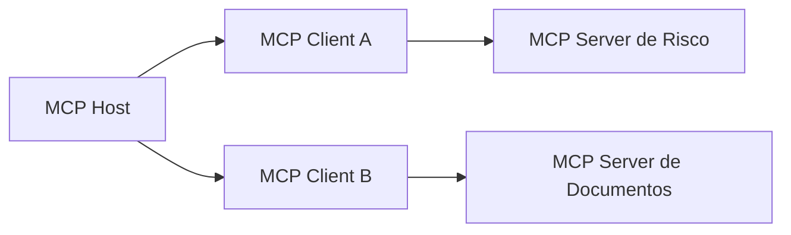
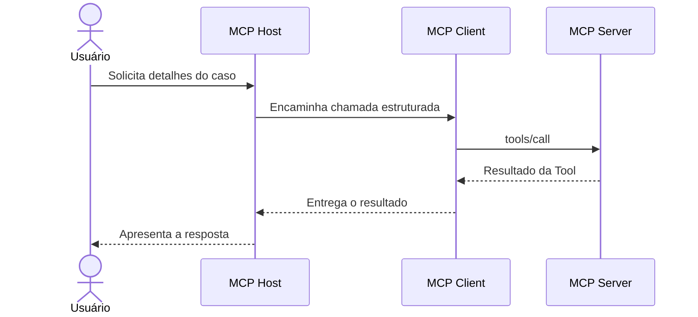
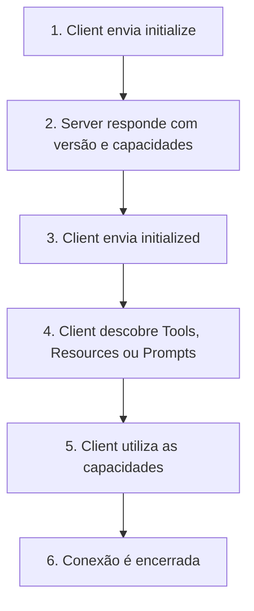
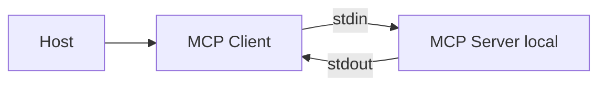
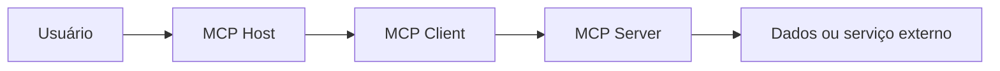

# Parte 2: Fundamentos e arquitetura do MCP

## O que aprenderemos nesta parte?

Antes de escrever código, precisamos criar um modelo mental simples do Model Context Protocol (MCP).

Ao final desta parte, você deverá conseguir explicar:

- qual problema o MCP resolve;
- o que são MCP Host, MCP Client e MCP Server;
- por que um Host cria um Client separado para cada Server;
- como uma solicitação percorre a arquitetura;
- o que diferencia Tools, Resources e Prompts;
- por que MCP utiliza JSON-RPC 2.0;
- o que são STDIO e Streamable HTTP;
- onde existem fronteiras de confiança;
- por que usar MCP não torna uma aplicação segura automaticamente.

Nenhum servidor será implementado ainda. Nesta parte, nosso objetivo é entender as peças antes de implementar.

## Afinal, qual problema o MCP resolve?

Imagine uma aplicação de inteligência artificial que precisa:

- consultar documentos;
- pesquisar registros em um banco de dados;
- acessar uma API;
- criar um relatório;
- pedir uma confirmação ao usuário.

Sem um protocolo comum, cada integração pode ter seu próprio formato, biblioteca, regras e maneira de se comunicar. A aplicação precisaria aprender uma integração diferente para cada sistema.

O MCP oferece uma forma padronizada para aplicações de IA descobrirem capacidades, enviarem solicitações e receberem resultados.

Em linguagem simples:

> MCP é um acordo de comunicação entre uma aplicação de IA e os sistemas que fornecem dados ou executam ações.

Esse “acordo” define, por exemplo:

- como iniciar uma conexão;
- como anunciar capacidades;
- como listar uma Tool;
- como chamar uma Tool;
- como ler um Resource;
- como obter um Prompt;
- como devolver sucesso ou erro.

### O que MCP não é?

MCP não é:

- um Large Language Model (LLM);
- um agente de IA;
- um banco de dados;
- uma API de negócio;
- uma ferramenta de segurança;
- uma garantia de que toda integração é confiável.

O protocolo organiza a comunicação. A aplicação continua responsável pelas regras de negócio, permissões, validações, aprovações e proteções necessárias.

## Uma analogia: empresa, linhas telefônicas e departamentos

Imagine uma empresa com uma pessoa coordenadora e vários departamentos especializados.

- A pessoa coordenadora recebe o pedido.
- Para falar com cada departamento, existe uma linha telefônica dedicada.
- Cada departamento informa quais serviços consegue realizar.
- A pessoa coordenadora escolhe o departamento adequado.
- O departamento executa o trabalho e devolve o resultado.

Podemos relacionar essa empresa à arquitetura MCP:

| Analogia | Componente MCP | Responsabilidade |
|---|---|---|
| Pessoa coordenadora | MCP Host | Coordena a experiência, o modelo e as conexões |
| Linha dedicada | MCP Client | Mantém a comunicação com um Server específico |
| Departamento especializado | MCP Server | Fornece dados, modelos de interação ou ações |
| Ordem de serviço | Tool | Solicita a execução de uma ação |
| Documento consultável | Resource | Disponibiliza informação contextual |
| Formulário reutilizável | Prompt | Oferece um modelo de interação |

A analogia possui um detalhe importante: cada departamento tem sua própria linha. A pessoa coordenadora não usa a mesma linha para misturar todas as conversas.

Da mesma forma, um MCP Host cria um MCP Client separado para cada MCP Server.

## Os três participantes principais

### 1. MCP Host

O **MCP Host** é a aplicação de IA com a qual a pessoa interage.

Exemplos possíveis incluem um editor de código com recursos de IA, um assistente de desktop ou uma aplicação corporativa criada pela própria organização.

O Host normalmente:

- recebe a solicitação do usuário;
- integra o LLM;
- cria e gerencia MCP Clients;
- decide quais Servers podem ser conectados;
- agrega as capacidades oferecidas pelos Servers;
- apresenta Tools, Resources e Prompts à aplicação;
- controla consentimento e políticas no seu próprio limite;
- devolve a resposta final ao usuário.

No nosso cenário, poderíamos criar futuramente uma aplicação de análise de risco atuando como Host. Entretanto, este repositório começará pelo MCP Server, não pela construção de um Host completo.

### 2. MCP Client

O **MCP Client** é o componente criado pelo Host para manter uma conexão com um MCP Server específico.

Ele funciona como a linha dedicada da nossa analogia.

O Client:

- inicia a comunicação;
- negocia a versão do protocolo;
- informa quais capacidades suporta;
- descobre as capacidades do Server;
- envia solicitações;
- recebe resultados e notificações;
- mantém a sessão daquele Server isolada das demais.

A relação importante é:

> Um MCP Client mantém uma conexão individual com um MCP Server.

Se o Host utilizar três Servers, normalmente ele criará três Clients separados.



O Server de Risco não deveria enxergar automaticamente a conversa mantida com o Server de Documentos. O Host coordena o que será compartilhado.

### 3. MCP Server

O **MCP Server** é o programa que expõe capacidades utilizando o protocolo MCP.

Ele pode:

- executar uma ação por meio de uma Tool;
- fornecer dados por meio de um Resource;
- oferecer um modelo reutilizável por meio de um Prompt;
- informar mudanças usando Notifications.

Um Server pode executar:

- localmente, na mesma máquina do Host;
- remotamente, como um serviço acessado pela rede.

> “Server” descreve o papel do programa na comunicação. Não significa obrigatoriamente uma máquina remota.

Nosso **Enterprise Risk Knowledge MCP Server** será o departamento especializado em políticas e casos fictícios de risco.

## Host, Client e Server trabalhando juntos

Considere esta solicitação:

> “Mostre os detalhes do caso de risco CASE-001.”

O fluxo simplificado será:



Passo a passo:

1. O usuário envia uma solicitação ao Host.
2. O Host interpreta a intenção com auxílio do LLM.
3. O Host identifica uma Tool adequada.
4. O MCP Client envia uma mensagem estruturada ao Server.
5. O Server localiza e executa a Tool.
6. O Server devolve um resultado estruturado.
7. O Client entrega esse resultado ao Host.
8. O Host decide como utilizar o resultado e responder ao usuário.

O LLM não conversa diretamente com o banco de dados. O MCP Server também não precisa possuir um LLM interno. O Host coordena a utilização do modelo e das capacidades externas.

## As duas camadas do MCP

A arquitetura do MCP pode ser separada em duas camadas.

### Camada de dados

A **data layer**, ou camada de dados, define o significado e o formato das mensagens trocadas.

Ela trata de:

- ciclo de vida da conexão;
- negociação de capacidades;
- Tools, Resources e Prompts;
- solicitações e respostas;
- erros;
- notificações;
- acompanhamento de progresso.

Essa camada utiliza JSON-RPC 2.0.

### Camada de transporte

A **transport layer**, ou camada de transporte, define por onde as mensagens viajam.

Ela trata de:

- abertura do canal de comunicação;
- enquadramento das mensagens;
- envio e recebimento;
- aspectos de autenticação relacionados ao transporte;
- encerramento da comunicação.

Uma analogia simples:

> A camada de dados é o idioma e o formato da carta. A camada de transporte é o meio utilizado para entregá-la.

A mesma mensagem MCP pode viajar por STDIO ou Streamable HTTP. O conteúdo segue o protocolo; o caminho utilizado para transportá-lo é diferente.

## O que é JSON-RPC 2.0?

JSON-RPC significa **JavaScript Object Notation Remote Procedure Call**.

Em linguagem simples:

> JSON-RPC é uma maneira padronizada de pedir que outro processo execute uma operação e devolva um resultado.

Uma solicitação contém normalmente:

- `jsonrpc`: versão do JSON-RPC;
- `id`: identificador que relaciona a solicitação à resposta;
- `method`: nome da operação;
- `params`: dados necessários para a operação.

Exemplo didático:

```json
{
  "jsonrpc": "2.0",
  "id": 1,
  "method": "tools/call",
  "params": {
    "name": "risk.get_case_details",
    "arguments": {
      "caseId": "CASE-001"
    }
  }
}
```

Uma resposta bem-sucedida utiliza o mesmo `id`:

```json
{
  "jsonrpc": "2.0",
  "id": 1,
  "result": {
    "content": [
      {
        "type": "text",
        "text": "Detalhes fictícios do caso CASE-001"
      }
    ]
  }
}
```

Se ocorrer uma falha, a resposta pode utilizar `error` em vez de `result`.

### Request, Response e Notification

| Tipo | Significado | Possui `id`? | Espera resposta? |
|---|---|---:|---:|
| Request | Solicita uma operação | Sim | Sim |
| Response | Responde a uma solicitação | Sim | Não se aplica |
| Notification | Informa um evento | Não | Não |

Uma Notification não possui `id` porque não espera resposta.

O SDK TypeScript cuidará de grande parte desses detalhes. Ainda assim, compreender JSON-RPC será importante para depuração, logs e segurança.

## O ciclo de vida de uma conexão MCP

MCP é um protocolo com ciclo de vida. Client e Server não deveriam começar executando operações sem antes se apresentarem e negociarem suas capacidades.

O fluxo simplificado é:



Durante a inicialização, Client e Server informam:

- versão de protocolo que compreendem;
- nome e versão da implementação;
- capacidades que suportam;
- possibilidade de enviar determinadas notificações.

Isso é chamado de **capability negotiation**, ou negociação de capacidades.

Em linguagem simples:

> Antes de trabalhar juntos, os dois lados confirmam qual idioma e quais recursos conseguem utilizar.

## As primitivas oferecidas pelo MCP Server

Uma **primitive**, ou primitiva, é uma forma básica de capacidade definida pelo protocolo.

Um MCP Server pode expor três primitivas principais:

- Tools;
- Resources;
- Prompts.

Elas não são três maneiras diferentes de fazer a mesma coisa.

### Tools: executar alguma coisa

Uma **Tool** representa uma função que pode ser invocada para consultar ou alterar algo.

Exemplos:

- consultar os detalhes de um caso;
- pesquisar registros;
- criar um relatório;
- enviar uma solicitação;
- executar uma consulta autorizada.

No nosso projeto:

```text
risk.get_case_details
```

será uma Tool porque recebe argumentos, executa uma lógica e devolve um resultado.

Uma Tool possui metadados como:

- nome;
- descrição;
- schema de entrada;
- eventualmente schema de saída;
- informações que ajudam o Client e o modelo a compreenderem seu uso.

> Tool não significa automaticamente “operação perigosa”. Entretanto, toda Tool deve ser tratada de acordo com o impacto da ação que consegue realizar.

### Resources: disponibilizar informação

Um **Resource** representa um dado que pode ser lido e utilizado como contexto.

Exemplos:

- conteúdo de um arquivo;
- manual de políticas;
- schema de banco de dados;
- catálogo de documentos;
- registro disponibilizado para leitura.

Um Resource é identificado por uma URI, por exemplo:

```text
risk://policies/catalog
```

No nosso projeto, poderíamos futuramente expor um catálogo fictício de políticas como Resource. Isso ainda será uma decisão posterior; não estamos implementando esse Resource nesta parte.

Diferença simplificada:

- uma Tool pede que o Server execute uma operação;
- um Resource pede que o Server disponibilize uma informação.

### Prompts: oferecer um modelo reutilizável

Um **Prompt** representa um modelo reutilizável para estruturar uma interação.

Exemplos:

- roteiro para revisar um caso;
- perguntas obrigatórias de uma investigação;
- template para preparar uma análise;
- sequência de mensagens com instruções e exemplos.

Poderíamos futuramente ter:

```text
review-risk-case
```

Esse Prompt poderia preparar uma estrutura de revisão sem executar sozinho uma operação no sistema.

> Um Prompt MCP não é necessariamente o system prompt secreto de uma aplicação. É uma capacidade explicitamente oferecida pelo Server e obtida pelo Client.

### Comparação das primitivas

| Primitiva | Pergunta simples | Exemplo no domínio |
|---|---|---|
| Tool | “O que posso executar?” | Consultar detalhes de um caso |
| Resource | “Que informação posso ler?” | Catálogo de políticas |
| Prompt | “Que modelo de interação posso reutilizar?” | Roteiro de revisão de risco |

## Como o Client descobre as capacidades?

O Client não precisa presumir quais capacidades existem. Ele pode perguntar ao Server.

Exemplos de operações:

| Operação | Finalidade |
|---|---|
| `tools/list` | Listar Tools disponíveis |
| `tools/call` | Executar uma Tool |
| `resources/list` | Listar Resources |
| `resources/read` | Ler um Resource |
| `prompts/list` | Listar Prompts |
| `prompts/get` | Obter um Prompt |

Essa descoberta pode ser dinâmica. Um Server pode alterar a lista de capacidades e notificar o Client.

Essa flexibilidade também introduz uma preocupação de segurança: o Host não deveria confiar cegamente em uma capacidade apenas porque ela apareceu na lista.

## O que são transports?

Um **transport**, ou transporte, é o mecanismo utilizado para levar mensagens entre Client e Server.

A especificação do MCP define dois transportes principais:

- STDIO;
- Streamable HTTP.

### STDIO

STDIO significa **standard input/output**, ou entrada e saída padrão.

Nesse modelo:

- o Host inicia o MCP Server como um processo local;
- o Client envia mensagens pela entrada padrão do processo;
- o Server devolve mensagens pela saída padrão;
- normalmente existe um Client para aquele processo;
- não há comunicação de rede entre os dois processos.



Vantagens introdutórias:

- configuração simples para desenvolvimento local;
- baixa sobrecarga;
- não exige criar um endpoint HTTP;
- adequado para aprender o funcionamento básico.

Cuidados:

- a saída padrão é o canal do protocolo e não deve ser misturada com logs comuns;
- permissões do processo local continuam importantes;
- local não significa automaticamente seguro;
- o Server pode herdar acesso excessivo a arquivos, variáveis ou comandos.

### Streamable HTTP

No Streamable HTTP:

- o Server é acessado por HTTP;
- mensagens do Client são enviadas por HTTP POST;
- o Server pode utilizar Server-Sent Events para streaming;
- um serviço remoto pode atender múltiplos Clients;
- mecanismos HTTP de autenticação e proteção de rede tornam-se relevantes.


Vantagens introdutórias:

- permite acesso remoto;
- integra-se à infraestrutura web;
- pode atender vários Clients;
- permite utilizar mecanismos comuns de autenticação HTTP.

Cuidados:

- aumenta a superfície exposta pela rede;
- exige autenticação e autorização adequadas;
- precisa considerar TLS, sessões, origem, limites e observabilidade;
- remoto não significa enterprise automaticamente.

### Comparação inicial

| Aspecto | STDIO | Streamable HTTP |
|---|---|---|
| Execução comum | Local | Remota |
| Canal | stdin/stdout | HTTP POST e streaming opcional |
| Rede | Não é necessária | É necessária |
| Quantidade típica de Clients | Um por processo | Vários |
| Autenticação HTTP | Não se aplica | Pode ser necessária |
| Uso inicial neste tutorial | Parte 3 | Partes enterprise posteriores |

## Decisão arquitetural do tutorial

Na Parte 3 construiremos primeiro um MCP Server mínimo com STDIO.

Essa é uma **decisão didática do projeto**, e não uma exigência da NSA nem uma regra de que STDIO seja sempre melhor.

Escolhemos STDIO inicialmente porque ele permite observar:

- inicialização;
- descoberta;
- execução de Tool;
- mensagens;
- comportamento do SDK;

sem introduzir imediatamente:

- endpoints HTTP;
- autenticação remota;
- sessões web;
- infraestrutura de rede.

Mais tarde evoluiremos o projeto para Streamable HTTP quando os controles enterprise exigirem um cenário remoto mais realista.

## Onde começam as fronteiras de confiança?

Uma **trust boundary**, ou fronteira de confiança, é um ponto onde dados ou comandos passam de um contexto de confiança para outro.

Em linguagem simples:

> Toda vez que uma informação atravessa de uma parte do sistema para outra, precisamos perguntar se o lado que recebe pode confiar nela.

No fluxo MCP existem várias fronteiras:



Perguntas importantes:

- O Host pode confiar no texto enviado pelo usuário?
- O Client pode confiar na descrição anunciada pelo Server?
- O Server pode confiar nos argumentos enviados pelo Client?
- O Server pode confiar nos dados devolvidos por um sistema externo?
- O Host pode confiar no resultado devolvido pela Tool?
- Um Server deveria conhecer dados de outro Server?

A resposta segura não é simplesmente “sim”.

Cada transição precisa de validação, autorização, limitação ou monitoramento proporcional ao risco.

## Relação com o relatório da NSA

Até aqui, estudamos a arquitetura definida pelo MCP. Agora podemos relacioná-la às preocupações descritas pela NSA.

### 1. Invocação dinâmica de Tools

O Client pode descobrir Tools em tempo de execução. Essa flexibilidade é útil, mas uma Tool nova ou modificada não deveria receber confiança automaticamente.

### 2. Relações de confiança implícitas

Um resultado pode passar do Server para o Host e depois ser utilizado pelo LLM ou por outro componente. Se todos presumirem que o resultado é seguro, uma instrução maliciosa pode se propagar.

### 3. Compartilhamento de contexto

O Host coordena múltiplos Clients e Servers. Ele precisa controlar qual contexto será compartilhado com cada conexão.

### 4. Validação e autorização não são automáticas

O protocolo oferece o formato de comunicação. Ele não conhece, por exemplo, quais casos a analista Ana pode consultar. Essa regra pertence à aplicação e deverá ser implementada por nós.

### 5. Transporte não substitui segurança

Utilizar HTTP, HTTPS ou um SDK oficial não resolve sozinho:

- Broken Access Control;
- excesso de privilégios;
- indirect prompt injection;
- replay;
- falta de aprovação;
- ausência de logs;
- Tool poisoning.

Essa é a primeira ligação entre arquitetura MCP e segurança enterprise:

> Precisamos compreender por onde dados e ações circulam antes de decidir onde aplicar os controles.

## Protocolo, recomendação e decisão do projeto

Para evitar confusão durante o tutorial:

| Categoria | Exemplo desta parte |
|---|---|
| Especificação do MCP | Um Host cria um Client dedicado para cada Server |
| Recomendação da NSA | Definir fronteiras claras entre componentes e zonas |
| Decisão do projeto | Começar a implementação usando STDIO |
| Regra de negócio fictícia | Um usuário só pode consultar casos do seu escopo |

Manter essa separação impedirá que uma decisão nossa seja apresentada incorretamente como obrigação do protocolo ou da NSA.

## Resumo da Parte 2

Aprendemos que:

- MCP padroniza a comunicação entre aplicações de IA e sistemas externos;
- o Host coordena a aplicação, o modelo e os Clients;
- cada Client mantém uma conexão com um Server;
- o Server expõe capacidades especializadas;
- a camada de dados utiliza JSON-RPC 2.0;
- a camada de transporte leva as mensagens;
- Tools executam operações;
- Resources fornecem informações;
- Prompts oferecem modelos reutilizáveis;
- STDIO é adequado para o primeiro laboratório local;
- Streamable HTTP será introduzido posteriormente;
- todas as transições relevantes precisam ser avaliadas como fronteiras de confiança;
- MCP não aplica automaticamente as regras de segurança do nosso domínio.

## Verifique seu entendimento

Antes de avançar, tente responder sem consultar o texto:

1. Qual é a diferença entre MCP Host e MCP Client?
2. Por que um Host cria Clients separados?
3. Qual é a diferença entre Tool, Resource e Prompt?
4. Qual é a função do JSON-RPC 2.0?
5. Qual é a diferença entre camada de dados e camada de transporte?
6. Por que executar um Server localmente não significa que ele seja seguro?
7. Qual parte do sistema deverá verificar se uma pessoa pode consultar determinado caso?

Essas perguntas serão discutidas durante a revisão. Não avançaremos enquanto os conceitos não estiverem claros.

## Próxima parte

Na Parte 3 criaremos o primeiro MCP Server em TypeScript usando STDIO. Veremos a estrutura mínima do projeto, o SDK oficial, a inicialização, o registro de uma Tool simples e a inspeção das mensagens.

A Parte 3 somente será iniciada após a revisão e aprovação deste texto.

## Referências

- [MCP — Architecture overview](https://modelcontextprotocol.io/docs/learn/architecture)
- [MCP Specification — Architecture](https://modelcontextprotocol.io/specification/2025-11-25/architecture)
- [MCP Specification — Transports](https://modelcontextprotocol.io/specification/2025-11-25/basic/transports)
- [MCP Specification — Server features](https://modelcontextprotocol.io/specification/2025-11-25/server)
- [JSON-RPC 2.0 Specification](https://www.jsonrpc.org/specification)
- [NSA — Model Context Protocol (MCP): Security Design Considerations for AI-Driven Automation](https://www.nsa.gov/Portals/75/documents/Cybersecurity/CSI_MCP_SECURITY.pdf)
