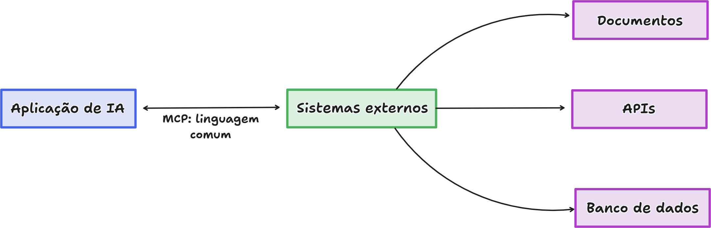
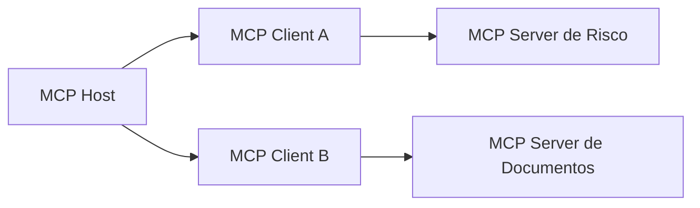
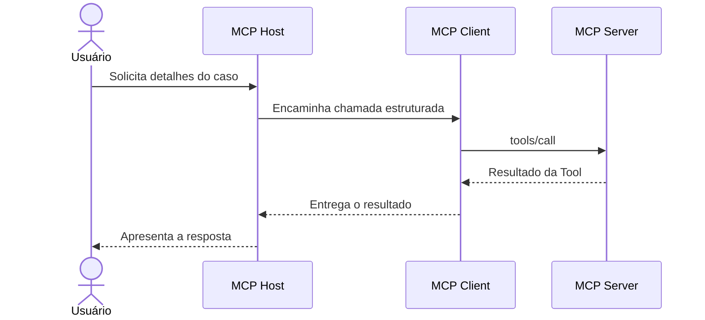
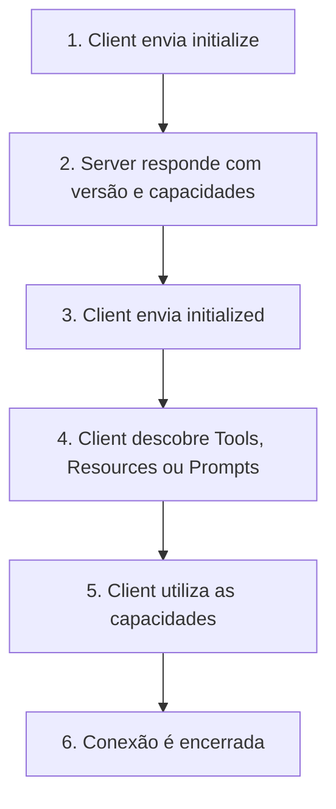
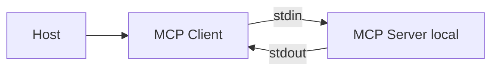
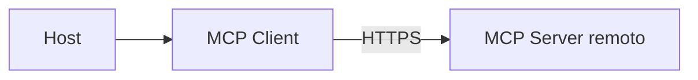
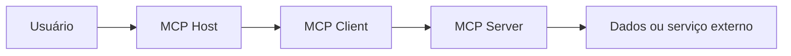

# Parte 2: Fundamentos e arquitetura do MCP

## O que aprenderemos nesta parte?

Antes de escrever qualquer código, precisamos construir um modelo mental simples do Model Context Protocol (MCP). Isso significa compreender por que ele existe, quais componentes participam da comunicação e qual responsabilidade pertence a cada um.

Durante esta parte, acompanharemos uma solicitação desde o momento em que a pessoa conversa com uma aplicação de inteligência artificial até o instante em que um MCP Server devolve um resultado. Nesse caminho, conheceremos MCP Host, MCP Client, MCP Server, Tools, Resources, Prompts, JSON-RPC 2.0 e os transportes STDIO e Streamable HTTP.

Ainda não criaremos o servidor. Primeiro entenderemos as peças. Aí sim, na Parte 3, começaremos a implementar.

## Afinal, qual problema o MCP resolve?

Imagine uma aplicação de inteligência artificial que precisa consultar documentos, pesquisar registros em um banco de dados, acessar APIs, criar relatórios e pedir confirmações ao usuário.

Sem um protocolo comum, cada integração pode adotar seu próprio formato, sua própria biblioteca e suas próprias regras. A aplicação precisaria conhecer uma maneira diferente de comunicação para cada sistema conectado. Isso aumenta o acoplamento e dificulta a reutilização das integrações.

O MCP oferece uma forma padronizada para aplicações de IA descobrirem capacidades, enviarem solicitações e receberem resultados.

Em linguagem simples:

> MCP é um acordo de comunicação entre uma aplicação de IA e os sistemas que fornecem dados ou executam ações.

Aqui segue uma excelente representação visual do fluxo de comunicação:



> A aplicação de IA não precisa aprender uma forma completamente diferente de comunicação para cada sistema. O MCP oferece uma linguagem comum para solicitar dados ou ações e receber resultados.

Esse acordo define como uma conexão começa, como cada lado anuncia o que sabe fazer, como uma capacidade é descoberta e utilizada e como sucessos ou erros são devolvidos.

MCP, porém, não é um Large Language Model (LLM), um agente, um banco de dados ou uma API de negócio. Também não é uma ferramenta de segurança nem uma garantia de que toda integração seja confiável. O protocolo organiza a comunicação; as regras de negócio, permissões, validações, aprovações e proteções continuam sendo responsabilidade da aplicação e da infraestrutura.

## Uma analogia: empresa, linhas telefônicas e departamentos

Imagine uma empresa formada por uma pessoa coordenadora e vários departamentos especializados. A coordenadora recebe um pedido, identifica qual departamento consegue atendê-lo e utiliza uma linha telefônica dedicada para conversar com esse departamento. O departamento informa quais serviços oferece, executa o trabalho solicitado e devolve o resultado pela mesma linha.

Podemos relacionar essa empresa à arquitetura MCP:

| Analogia | Componente MCP | Responsabilidade |
|---|---|---|
| Pessoa coordenadora | MCP Host | Coordena a experiência, o modelo e as conexões |
| Linha dedicada | MCP Client | Mantém a comunicação com um Server específico |
| Departamento especializado | MCP Server | Fornece dados, modelos de interação ou ações |
| Ordem de serviço | Tool | Solicita a execução de uma ação |
| Documento consultável | Resource | Disponibiliza informação contextual |
| Formulário reutilizável | Prompt | Oferece um modelo de interação |

O detalhe mais importante da analogia é que cada departamento possui sua própria linha. A coordenadora não mistura todas as conversas em uma única ligação. Da mesma forma, um MCP Host cria um MCP Client separado para cada MCP Server.

## Os três participantes principais

### MCP Host: quem coordena a experiência

O **MCP Host** é a aplicação de IA com a qual a pessoa interage. Um editor de código com recursos de IA, um assistente de desktop ou uma aplicação corporativa podem exercer esse papel.

O Host recebe a solicitação do usuário e coordena a utilização do LLM. Ele também cria e gerencia os MCP Clients, decide quais Servers podem ser conectados e reúne as capacidades oferecidas por eles. É ainda no limite do Host que normalmente aparecem decisões de consentimento, integração com o modelo e apresentação da resposta final.

No nosso cenário, uma aplicação de análise de risco poderia atuar como Host. Entretanto, este repositório começará pela construção do MCP Server; não criaremos agora um Host completo.

### MCP Client: a conexão dedicada

O **MCP Client** é o componente criado pelo Host para manter uma conexão com um MCP Server específico. Ele funciona como a linha telefônica dedicada da nossa analogia.

Quando a conexão começa, o Client negocia a versão do protocolo e informa as capacidades que suporta. Depois, descobre o que o Server oferece, envia solicitações e recebe resultados ou notificações. A sessão daquele Server permanece separada das sessões mantidas com outros Servers.

A relação central pode ser resumida assim:

> Um MCP Client mantém uma conexão individual com um MCP Server.

Se o Host utilizar três Servers, normalmente criará três Clients separados.



O Server de Risco não deveria enxergar automaticamente a conversa mantida com o Server de Documentos. O Host coordena o que será compartilhado com cada conexão.

### MCP Server: quem fornece capacidades

O **MCP Server** é o programa que expõe capacidades utilizando o protocolo MCP. Essas capacidades podem executar ações, fornecer informações, oferecer modelos reutilizáveis de interação ou comunicar mudanças.

Um Server pode rodar localmente, na mesma máquina do Host, ou remotamente, como um serviço acessado pela rede. Portanto, a palavra “Server” descreve o papel do programa na comunicação; ela não significa obrigatoriamente uma máquina remota.

Nosso **Enterprise Risk Knowledge MCP Server** será o departamento especializado em políticas e casos fictícios de risco.

## Host, Client e Server trabalhando juntos

Considere a seguinte solicitação:

> “Mostre os detalhes do caso de risco CASE-001.”

O fluxo simplificado será:



Primeiro, o usuário envia a solicitação ao Host. O Host interpreta a intenção com auxílio do LLM e identifica uma Tool apropriada. Em seguida, o MCP Client envia uma mensagem estruturada ao Server. O Server localiza a Tool, executa sua lógica e devolve um resultado. O Client entrega esse resultado ao Host, que decide como utilizá-lo na resposta apresentada ao usuário.

Perceba que o LLM não conversa diretamente com o banco de dados. O MCP Server também não precisa possuir um LLM interno. O Host coordena a utilização do modelo e das capacidades externas.

## As duas camadas do MCP

Para compreender melhor a comunicação, podemos separar a arquitetura do MCP em duas camadas: a camada de dados e a camada de transporte.

### Camada de dados: o significado da mensagem

A **data layer**, ou camada de dados, define o significado e o formato das mensagens trocadas. Nela estão o ciclo de vida da conexão, a negociação de capacidades, as Tools, Resources e Prompts, além de solicitações, respostas, erros e notificações.

Essa camada utiliza JSON-RPC 2.0.

### Camada de transporte: o caminho da mensagem

A **transport layer**, ou camada de transporte, define por onde as mensagens viajam. Ela cuida da abertura do canal de comunicação, do enquadramento das mensagens, do envio, do recebimento e do encerramento da conexão. Aspectos de autenticação ligados ao canal também aparecem nessa camada.

Uma analogia simples ajuda a separar as duas responsabilidades:

> A camada de dados é o idioma e o formato da carta. A camada de transporte é o meio utilizado para entregá-la.

A mesma mensagem MCP pode viajar por STDIO ou Streamable HTTP. O conteúdo segue o protocolo; o caminho utilizado para transportá-lo é diferente.

## O que é JSON-RPC 2.0?

JSON-RPC significa **JavaScript Object Notation Remote Procedure Call**.

Em linguagem simples:

> JSON-RPC é uma maneira padronizada de pedir que outro processo execute uma operação e devolva um resultado.

Observe esta solicitação didática:

```json
{
  "jsonrpc": "2.0",
  "id": 1,
  "method": "tools/call",
  "params": {
    "name": "risk.get_case_details",
    "arguments": {
      "caseId": "CASE-001"
    }
  }
}
```

O campo `jsonrpc` identifica a versão do JSON-RPC. O `id` permite relacionar a solicitação à resposta. O `method` informa qual operação deve ser executada, enquanto `params` carrega os dados necessários.

Uma resposta bem-sucedida reutiliza o mesmo `id`:

```json
{
  "jsonrpc": "2.0",
  "id": 1,
  "result": {
    "content": [
      {
        "type": "text",
        "text": "Detalhes fictícios do caso CASE-001"
      }
    ]
  }
}
```

Se ocorrer uma falha, a resposta pode utilizar `error` em vez de `result`.

### Request, Response e Notification

JSON-RPC trabalha com três tipos básicos de mensagem:

| Tipo | Significado | Possui `id`? | Espera resposta? |
|---|---|---:|---:|
| Request | Solicita uma operação | Sim | Sim |
| Response | Responde a uma solicitação | Sim | Não se aplica |
| Notification | Informa um evento | Não | Não |

Uma **Request** pede que algo seja feito. A **Response** apresenta o resultado ou o erro correspondente. A **Notification** apenas comunica que algo aconteceu e não possui `id`, pois não espera resposta.

O SDK TypeScript cuidará de grande parte desses detalhes. Mesmo assim, compreender JSON-RPC será importante quando precisarmos depurar mensagens, produzir logs ou investigar problemas de segurança.

## O ciclo de vida de uma conexão MCP

MCP é um protocolo com ciclo de vida. Client e Server não deveriam começar executando operações sem antes se apresentarem e negociarem suas capacidades.



O Client inicia enviando `initialize`. O Server responde informando a versão de protocolo e as capacidades que suporta. Quando essa negociação termina, o Client envia `notifications/initialized` para comunicar que está pronto. Somente depois começa a descoberta e a utilização das capacidades.

Esse processo recebe o nome de **capability negotiation**, ou negociação de capacidades.

Em linguagem simples:

> Antes de trabalhar juntos, os dois lados confirmam qual idioma e quais recursos conseguem utilizar.

## As primitivas oferecidas pelo MCP Server

Uma **primitive**, ou primitiva, é uma forma básica de capacidade definida pelo protocolo. Um MCP Server pode expor três primitivas principais: Tools, Resources e Prompts. Elas não são nomes diferentes para a mesma coisa; cada uma resolve um tipo específico de necessidade.

### Tools: quando precisamos executar algo

Uma **Tool** representa uma função que pode ser invocada para consultar ou alterar algo. Consultar detalhes de um caso, pesquisar registros, criar um relatório ou enviar uma solicitação são exemplos possíveis.

No nosso projeto, `risk.get_case_details` será uma Tool porque recebe argumentos, executa uma lógica e devolve um resultado.

Uma Tool anuncia um nome, uma descrição e um schema de entrada. Também pode possuir um schema de saída. Esses metadados ajudam o Client e o modelo a compreenderem quando e como a capacidade deve ser utilizada.

> Tool não significa automaticamente “operação perigosa”. Entretanto, toda Tool deve ser protegida de acordo com o impacto da ação que consegue realizar.

### Resources: quando precisamos ler informação

Um **Resource** representa um dado que pode ser lido e utilizado como contexto. O conteúdo de um arquivo, um manual de políticas, um schema de banco de dados ou um catálogo de documentos são exemplos de Resources.

Um Resource é identificado por uma URI. Poderíamos, por exemplo, utilizar:

```text
risk://policies/catalog
```

No nosso projeto, esse endereço poderia representar um catálogo fictício de políticas. Isso ainda será decidido em outra parte; não estamos implementando o Resource agora.

A diferença essencial é que uma Tool solicita a execução de uma operação, enquanto um Resource disponibiliza uma informação para leitura.

### Prompts: quando precisamos reutilizar uma estrutura

Um **Prompt** representa um modelo reutilizável para estruturar uma interação. Ele pode conter um roteiro para revisar um caso, as perguntas obrigatórias de uma investigação ou uma sequência de mensagens com instruções e exemplos.

Poderíamos futuramente oferecer:

```text
review-risk-case
```

Esse Prompt prepararia uma estrutura de revisão, mas não executaria sozinho uma operação no sistema.

> Um Prompt MCP não é necessariamente o system prompt secreto de uma aplicação. É uma capacidade explicitamente oferecida pelo Server e obtida pelo Client.

### Comparação das primitivas

| Primitiva | Pergunta simples | Exemplo no domínio |
|---|---|---|
| Tool | “O que posso executar?” | Consultar detalhes de um caso |
| Resource | “Que informação posso ler?” | Catálogo de políticas |
| Prompt | “Que modelo de interação posso reutilizar?” | Roteiro de revisão de risco |

## Como o Client descobre as capacidades?

O Client não precisa presumir quais capacidades existem. Ele pode perguntar ao Server. Para listar Tools, utiliza `tools/list`; para executar uma delas, utiliza `tools/call`. O mesmo padrão aparece em `resources/list` e `resources/read`, assim como em `prompts/list` e `prompts/get`.

Essa descoberta pode ser dinâmica. Se a lista de capacidades mudar, o Server pode enviar uma Notification e o Client pode atualizar seu catálogo.

A flexibilidade é útil, mas também cria uma preocupação de segurança: o Host não deveria confiar cegamente em uma capacidade apenas porque ela apareceu na lista. A origem, a descrição, a permissão e o impacto continuam precisando de avaliação.

## O que são transports?

Um **transport**, ou transporte, é o mecanismo utilizado para levar as mensagens entre Client e Server. A especificação do MCP define dois transportes principais: STDIO e Streamable HTTP.

### STDIO: comunicação entre processos locais

STDIO significa **standard input/output**, ou entrada e saída padrão. Nesse modelo, o Host inicia o MCP Server como um processo local. O Client envia mensagens pela entrada padrão do processo, chamada `stdin`, e o Server devolve mensagens pela saída padrão, chamada `stdout`.



Como não precisamos criar um endpoint HTTP, STDIO oferece um caminho simples para desenvolvimento local e possui pouca sobrecarga de comunicação. Por isso, será adequado para observarmos o funcionamento básico do protocolo na Parte 3.

Essa simplicidade não elimina os riscos. A saída padrão é o canal do protocolo e não deve ser misturada com logs comuns. Além disso, o processo local pode herdar acesso excessivo a arquivos, variáveis de ambiente ou comandos do sistema. Portanto, local não significa automaticamente seguro.

### Streamable HTTP: comunicação por rede

No Streamable HTTP, o Server é acessado por HTTP. O Client envia mensagens usando HTTP POST, e o Server pode utilizar Server-Sent Events quando precisa transmitir dados progressivamente.



Esse transporte permite que um serviço remoto atenda vários Clients e se integre à infraestrutura web da organização. Em contrapartida, a comunicação por rede aumenta a superfície exposta e introduz preocupações com autenticação, autorização, TLS, sessões, origem, limites de uso e observabilidade.

Um MCP Server remoto não se torna enterprise apenas por utilizar HTTPS. O canal protegido é somente uma parte da segurança.

### Comparação inicial

| Aspecto | STDIO | Streamable HTTP |
|---|---|---|
| Execução comum | Local | Remota |
| Canal | stdin/stdout | HTTP POST e streaming opcional |
| Rede | Não é necessária | É necessária |
| Quantidade típica de Clients | Um por processo | Vários |
| Autenticação HTTP | Não se aplica | Pode ser necessária |
| Uso inicial neste tutorial | Parte 3 | Partes enterprise posteriores |

## Por que começaremos com STDIO?

Na Parte 3 construiremos primeiro um MCP Server mínimo com STDIO. Essa é uma **decisão didática deste projeto**, não uma exigência da NSA nem uma regra de que STDIO seja sempre melhor.

Com STDIO, conseguiremos observar inicialização, descoberta, execução de Tool, mensagens e comportamento do SDK antes de introduzir endpoints HTTP, autenticação remota, sessões web e infraestrutura de rede.

Mais tarde, evoluiremos o projeto para Streamable HTTP quando precisarmos representar um cenário remoto e aplicar controles enterprise correspondentes.

## Onde começam as fronteiras de confiança?

Uma **trust boundary**, ou fronteira de confiança, é um ponto onde dados ou comandos passam de um contexto de confiança para outro.

Em linguagem simples:

> Sempre que uma informação atravessa de uma parte do sistema para outra, precisamos perguntar se o lado que recebe pode confiar nela.



Quando o usuário envia um texto, o Host não deveria presumir que ele é seguro. Quando o Server anuncia uma Tool, o Client não deveria considerar sua descrição confiável apenas por estar no formato esperado. Da mesma maneira, o Server precisa validar os argumentos recebidos, e o Host precisa examinar o resultado devolvido pela Tool antes de utilizá-lo em outra etapa.

Também precisamos perguntar se um Server deveria conhecer dados provenientes de outro Server. Segundo os princípios arquiteturais do MCP, cada conexão deve permanecer isolada, e o Host controla o contexto compartilhado.

A resposta segura não é simplesmente “sim, podemos confiar”. Cada transição precisa de validação, autorização, limitação ou monitoramento proporcional ao risco.

## Relação com o relatório da NSA

Até aqui estudamos a arquitetura definida pelo MCP. Agora conseguimos relacioná-la às preocupações descritas pela NSA.

O primeiro ponto é a **invocação dinâmica de Tools**. Um Client pode descobrir capacidades em tempo de execução, mas uma Tool nova ou modificada não deveria receber confiança automaticamente.

O segundo é a **confiança implícita**. O resultado de uma Tool pode passar do Server para o Host e depois ser utilizado pelo LLM ou por outro componente. Se todos presumirem que esse resultado é seguro, uma instrução maliciosa pode se propagar pela cadeia.

O terceiro é o **compartilhamento de contexto**. Como o Host coordena vários Clients e Servers, precisa controlar qual informação será entregue a cada conexão. Um Server não deveria receber automaticamente toda a conversa ou dados pertencentes a outro Server.

O quarto ponto é que **validação e autorização não aparecem automaticamente**. O protocolo oferece um formato de comunicação, mas não conhece as regras do nosso domínio. Ele não sabe, por exemplo, quais casos a analista Ana pode consultar. Essa regra pertence à aplicação e precisará ser implementada por nós.

Por fim, o **transporte não substitui segurança**. Utilizar HTTP, HTTPS ou um SDK oficial não resolve sozinho falhas de controle de acesso, excesso de privilégios, indirect prompt injection, replay, falta de aprovação, ausência de logs ou Tool poisoning.

Essa é a primeira ligação entre arquitetura MCP e segurança enterprise:

> Precisamos compreender por onde dados e ações circulam antes de decidir onde aplicar os controles.

## Protocolo, recomendação e decisão do projeto

Durante o tutorial, manteremos três fontes de decisão separadas. A especificação do MCP define, por exemplo, que um Host cria um Client dedicado para cada Server. A NSA recomenda que organizações definam fronteiras claras entre componentes e zonas. Já começar a implementação por STDIO é uma decisão didática deste projeto. Por fim, limitar cada usuário aos casos do seu escopo é uma regra do nosso domínio fictício.

| Categoria | Exemplo desta parte |
|---|---|
| Especificação do MCP | Um Host cria um Client dedicado para cada Server |
| Recomendação da NSA | Definir fronteiras claras entre componentes e zonas |
| Decisão do projeto | Começar a implementação usando STDIO |
| Regra de negócio fictícia | Um usuário só pode consultar casos do seu escopo |

Essa separação impedirá que uma decisão nossa seja apresentada incorretamente como obrigação do protocolo ou da NSA.

## O que aprendemos nesta parte?

MCP padroniza a comunicação entre aplicações de IA e sistemas externos. O Host coordena a experiência, o LLM e os Clients. Cada Client mantém uma conexão com um Server específico, enquanto o Server oferece capacidades especializadas.

Na camada de dados, MCP utiliza JSON-RPC 2.0 para definir mensagens e operações. Na camada de transporte, STDIO ou Streamable HTTP carregam essas mensagens. Tools executam operações, Resources disponibilizam informações e Prompts oferecem estruturas reutilizáveis.

Para o primeiro laboratório, utilizaremos STDIO. Mais adiante, introduziremos Streamable HTTP. Em qualquer um dos casos, as transições entre usuário, Host, Client, Server e sistemas externos precisam ser tratadas como possíveis fronteiras de confiança. O protocolo não implementa automaticamente as regras de segurança do nosso domínio.

## Verifique seu entendimento

Antes de avançar, tente responder sem consultar o texto:

1. Qual é a diferença entre MCP Host e MCP Client?
2. Por que um Host cria Clients separados?
3. Qual é a diferença entre Tool, Resource e Prompt?
4. Qual é a função do JSON-RPC 2.0?
5. Qual é a diferença entre camada de dados e camada de transporte?
6. Por que executar um Server localmente não significa que ele seja seguro?
7. Qual parte do sistema deverá verificar se uma pessoa pode consultar determinado caso?

Essas perguntas serão discutidas durante a revisão. Não avançaremos enquanto os conceitos não estiverem claros.

## Próxima parte

Na Parte 3 criaremos o primeiro MCP Server em TypeScript usando STDIO. Veremos a estrutura mínima do projeto, o SDK oficial, a inicialização, o registro de uma Tool simples e a inspeção das mensagens.

A Parte 3 somente será iniciada após a revisão e aprovação deste texto.

## Referências

As explicações desta parte foram baseadas nas seguintes fontes primárias:

1. [MCP — Architecture overview](https://modelcontextprotocol.io/docs/learn/architecture)
2. [MCP Specification — Architecture](https://modelcontextprotocol.io/specification/2025-11-25/architecture)
3. [MCP Specification — Transports](https://modelcontextprotocol.io/specification/2025-11-25/basic/transports)
4. [MCP Specification — Server features](https://modelcontextprotocol.io/specification/2025-11-25/server)
5. [JSON-RPC 2.0 Specification](https://www.jsonrpc.org/specification)
6. [NSA — Model Context Protocol (MCP): Security Design Considerations for AI-Driven Automation](https://www.nsa.gov/Portals/75/documents/Cybersecurity/CSI_MCP_SECURITY.pdf)
